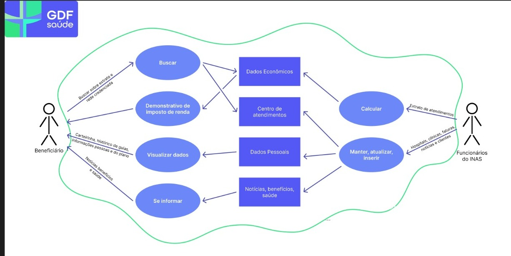
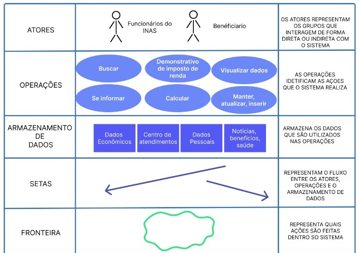

# Aplicativo escolhido

## Introdução
Durante a etapa inicial de seleção, o grupo avaliou potenciais aplicativos, ponderando critérios técnicos e impacto social. A princípio, o aplicativo CNH (Carteira Nacional de Habilitação Digital) foi considerado uma opção promissora, porém, ele foi selecionado por outro grupo antes de nossa definição final, o que demandou a exploração de alternativas. Opções como o Telegram foram analisadas, mas sua extensa gama de funcionalidades tornou inviável uma análise focada. O Sinesp Cidadão surgiu como a escolha definitiva, mas posteriormente, também foi desconsiderado. Diante disso, optamos definitivamente pelo aplicativo GDF Saúde, que atende aos critérios necessários para uma investigação técnica detalhada, além de apresentar relevância social no contexto de serviços públicos de saúde.

## Critérios da escolha
A seleção do GDF Saúde como objeto de estudo foi pautada pelos seguintes critérios estratégicos:
- Aplicativo ainda não trabalhado na disciplina anteriormente
- Sugestão do professor
- Complexidade média com requisitos diversificados
- Relevância para serviços públicos de saúde
- Impacto coletivo

## Termos de uso

Para assegurar que o projeto fosse conduzido de maneira ética e em conformidade com as normas aplicáveis, o grupo buscou consultar os Termos de Uso do aplicativo GDF Saúde, com o objetivo de verificar se havia permissão para realizar a análise planejada. No entanto, durante nossa pesquisa, não localizamos os Termos de Uso de forma acessível. No aplicativo, encontramos apenas a Política de Privacidade e a Política de Segurança, disponíveis em uma das páginas internas do sistema (conforme ilustrado na Figura 1).

<strong>Figura 1: Página interna do GDF Saúde</strong>

  

<em>Fonte: Aplicativo do GDF Saúde.</em>

Após uma análise cuidadosa desses documentos, constatamos que tanto a [Política de Privacidade](https://agente.sinesp.gov.br/politica-privacidade/) quanto o documento da [Política de Segurança](../assets/pdf/politicaSegurança.pdf) do GDF Saúde se concentram no tratamento de dados pessoais dos usuários, abordando aspectos como segurança da informação, direitos dos titulares e princípios de proteção de dados, conforme previsto pela Lei Geral de Proteção de Dados (LGPD). Contudo, não identificamos nenhuma cláusula específica que trate da autorização ou proibição do uso do aplicativo para fins acadêmicos, nem menções diretas à prática de engenharia reversa ou outras formas de análise técnica da aplicação.

Diante da ausência de diretrizes claras sobre esse tipo de uso, surgiram dúvidas quanto à legitimidade de prosseguir com o estudo sem uma autorização explícita por parte dos responsáveis pelo GDF Saúde. Buscando maior clareza e respaldo institucional, o grupo optou por tentar contato direto com os canais oficiais de suporte do sistema através de um [email](../assets/pdf/termos-de-uso.pdf), com o intuito de apresentar o caráter acadêmico do projeto e solicitar informações mais precisas sobre possíveis restrições.

Como ainda não obtivemos retorno, e considerando a falta de Termos de Uso acessíveis e de orientações específicas nos documentos disponíveis, o grupo decidiu adotar uma abordagem cautelosa. Optamos por limitar o escopo do trabalho à análise externa e à elicitação de requisitos observáveis no funcionamento geral do aplicativo, sem realizar qualquer prática que envolva engenharia reversa ou acesso à estrutura interna da aplicação. Com isso, reafirmamos nosso compromisso com uma postura ética e responsável, respeitando os limites legais e institucionais, bem como os princípios que regem a pesquisa acadêmica.

## Rich Picture
O RichPicture é uma técnica visual colaborativa utilizada para explorar e comunicar complexidades de sistemas, traduzindo conceitos abstratos em uma representação gráfica acessível. Sua abordagem informal e flexível permite uma compreensão holística do sistema, facilitando a identificação de gargalos, requisitos e oportunidades de melhoria, sem se prender a formalismos excessivos.

### Ferramentas
O [Figma](https://www.figma.com/community) foi utilizado para a criação do rich picture que pode ser visualizado na figura 2.

<strong>Figura 2: Rich Picture do GDF Saúde</strong>

  

<em>Fonte: Autores.</em>

<strong>Figura 3: Legenda do GDF Saúde</strong>

  

<em>Fonte: Autores.</em>

## Histórico de Versões

| Versão | Data | Descrição | Autor(es) | Revisor(es) |
|--------|------|-----------|-----------|-------------|
| 1.0 | 10/04/2025 | Criação da página de aplicativo escolhido | [Yzabella Miranda](https://github.com/redjsun) | [Ana Luiza](https://github.com/Ana-Luiza-SC)| 
| 1.1 | 10/04/2025 | Adição do termos de Uso | [Othavio Araujo Bolzan](https://github.com/bolzanMGB)  | [Ana Luiza](https://github.com/Ana-Luiza-SC) |
| 1.2 | 13/04/2025 | Alteração na formatação da foto| [Ana Luiza](https://github.com/Ana-Luiza-SC) | [Isaque Camargos](https://github.com/isaqzin) |
| 1.3 | 20/04/2025 | Atualização do aplicativo | [Othavio Araujo Bolzan](https://github.com/bolzanMGB), [Yzabella Miranda](https://github.com/redjsun)| [Ana Luiza](https://github.com/Ana-Luiza-SC) |
| 1.4 | 20/04/2025 | Correção bug fotos |  [Isaque Camargos](https://github.com/isaqzin)  | [Kaleb Macedo](https://github.com/kalebmacedo) |