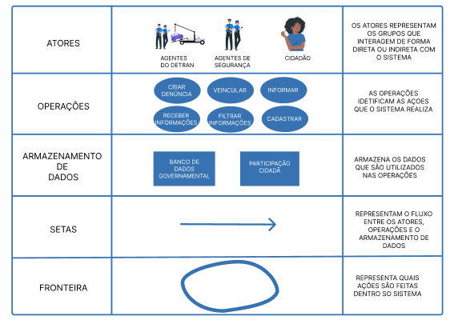

# Rich Picture

## Introdução

O *Rich Picture* é uma técnica visual colaborativa empregada para explorar e comunicar a complexidade de sistemas de forma acessível e intuitiva. No contexto da engenharia de requisitos, ele se apresenta como um recurso valioso para representar os principais elementos envolvidos em um sistema, como usuários, processos, fluxos de informação, limites e possíveis problemas. Essa representação informal contribui para uma visão sistêmica, facilitando o diálogo entre os envolvidos no projeto e apoiando a identificação de requisitos e pontos críticos.

No escopo deste trabalho, o *Rich Picture* foi desenvolvido com base no aplicativo **Sinesp Cidadão**, escolhido pelo grupo em razão de seu impacto social e estrutura técnica que permite uma análise rica em elementos. A técnica foi utilizada para ilustrar visualmente os atores, funcionalidades e interações centrais do sistema, respeitando os limites éticos definidos previamente pelo grupo, como a não realização de engenharia reversa.

## Metodologia e Ferramentas

A elaboração do *Rich Picture* foi realizada por meio da ferramenta **Figma**, que possibilitou a criação colaborativa do diagrama e da legenda correspondente. As ilustrações utilizadas na composição visual foram obtidas no site **StorySet**, e servem como apoio à compreensão do sistema representado.

Abaixo estão os espaços reservados para inserção do *Rich Picture* e de sua legenda:

  

<strong>Figura 1: Rich Picture do Sinesp Cidadão</strong> <em>Fonte: Autoria do grupo.</em>

  

<strong>Figura 2: Legenda do Rich Picture</strong> <em>Fonte: Autoria do grupo.</em>

## Referência

BRASIL. *Sinesp Cidadão*. [2025]. Disponível em: https://www.gov.br/pt-br/apps/sinesp-cidadao. Acesso em: 12 abr. 2025.

CTEC2402 Software Development Project. *Introducing Rich Pictures*. 2023.

SERRANO, Maurício; SERRANO, Milene. *Requisitos - Aula 4*. Aprender 3. Distrito Federal, 2016. Disponível em: https://aprender3.unb.br/pluginfile.php/2523050/mod_resource/content/4/Requisitos%20-%20Aula%2004%20-%20Parte%202%20RichPicture.pdf. Acesso em: 14 abr. 2023.
## Histórico de Versões

| Versão | Data       | Descrição                              | Autor(a)         | Revisor(a)   |
|--------|------------|-----------------------------------------|------------------|--------------|
| 1.0    | 12/04/2025 | Adição da primeira versão do Rich Picture | [Ana Luiza](https://github.com/Ana-Luiza-SC) | [Kaleb Macedo](https://github.com/kalebmacedo) |
| 1.1    | 13/04/2025 | Alteração na formatação da foto        | [Ana Luiza](https://github.com/Ana-Luiza-SC) | [Kaleb Macedo](https://github.com/kalebmacedo) |

